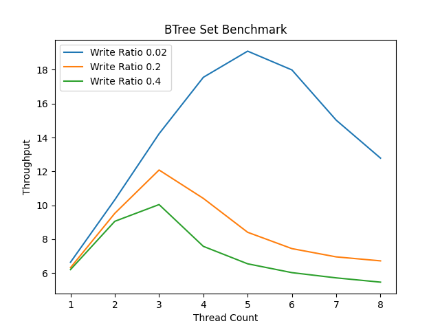

# Read Log Update in Rust

Implementation of Read Log Update in Rust


### Running Benchmarks:

To run the single object benchmarks

```bash
cargo run --bin benchmark --release
```

To run RLU based Set benchmarks

```bash
cargo run --bin benchmark_rlu_set --release
```


To run Rust's BTree Set benchmarks

```bash
cargo run --bin benchmark_btree_set --release
```




### Benchmarking Plot

To install necessary libraries for making the benchmark plots:

```bash
pip install -r requirements.txt
```

To run the benchmark plots:

```bash
python bench_plot.py
```
