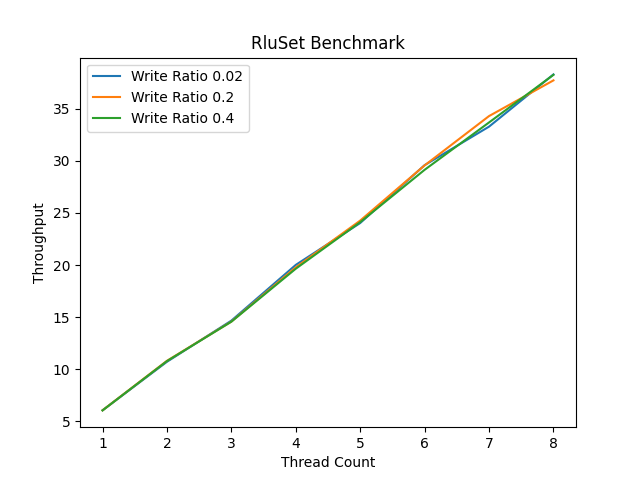

# Read Log Update in Rust

Implementation of Read Log Update in Rust


### Running Benchmarks:

To run the single object benchmarks

```bash
make all
```

To run RLU based Set benchmarks

```bash
make rluset-btree
```



To run Rust's BTree Set benchmarks

```bash
make benchmark-btree
```


### Benchmarking Plot

To install necessary libraries for making the benchmark plots:

```bash
make deps
```

To run the benchmark plots:

```bash
make plot
```
